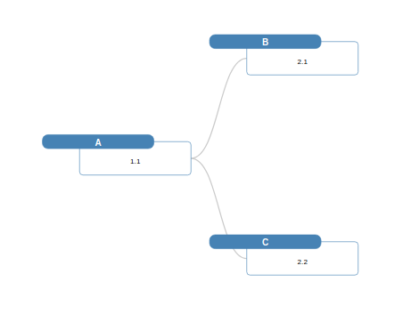
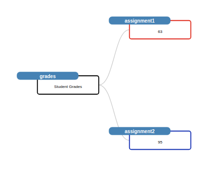

# dynamic-javascript-trees

Examples of dynamic javascript trees using d3-mitch-tree

## Description

An in-depth paragraph about your project and overview of use.

## Getting Started

### Base JavaScript Library

* https://d3-mitch-tree.netlify.app

## Contents

### 01_simplest

Contains the code to recreate this tree

### 02_custom_css_body

Contains the code to recreate this tree

